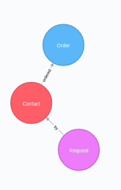

# proces_neo4j_ingest [](https://travis-ci.org/selvathiruarul/process_neo4j_ingest)

## Description
Python process to ingest data into Neo4j database and find answers for following questions

1) How many rid nodes are there with no edges?
2) How many cid nodes have more than one edge to an oid node?
3) Are there any rid nodes with multiple cid nodes? If so, what percent?


## Requirements:
    -Neo4j
    -Python3
    -neo4j.v1
## Set Environment variables
    -file_name = 
    -uri = 
    -neo4j_username=

## pyest
    -pytest

## To Run:
    python3 ./process_neo_4j_ingest/main.py
    
## SAMPLE

    
## ANSWERS

1) How many rid nodes are there with no edges?

```
OPTIONAL MATCH (request)-[relation:by]->(contact) WHERE relation is null RETURN count(request) as total
```
|TOTAL|
|-----|
| 0   |
|-----|

2) How many cid nodes have more than one edge to an oid node?

```
MATCH (contact)-[r:ordered]->(order) WITH contact, count(r) as rel_cnt WHERE rel_cnt > 1 RETURN count(contact) as total

```
|TOTAL|
|-----|
|1197 |
|-----|


3) Are there any rid nodes with multiple cid nodes? If so, what percent?

```
MATCH (contact)<-[k:by]-(request) with count(distinct request) as total MATCH (contact)<-[k:by]-(request) with total,request,count(distinct contact) as cus where cus>1 return round(toFloat(count(cus))/toFloat(total)*100*100)/100 as percentage
```

|PERCENTAGE|
|----------|
|  3.75    |
|----------|